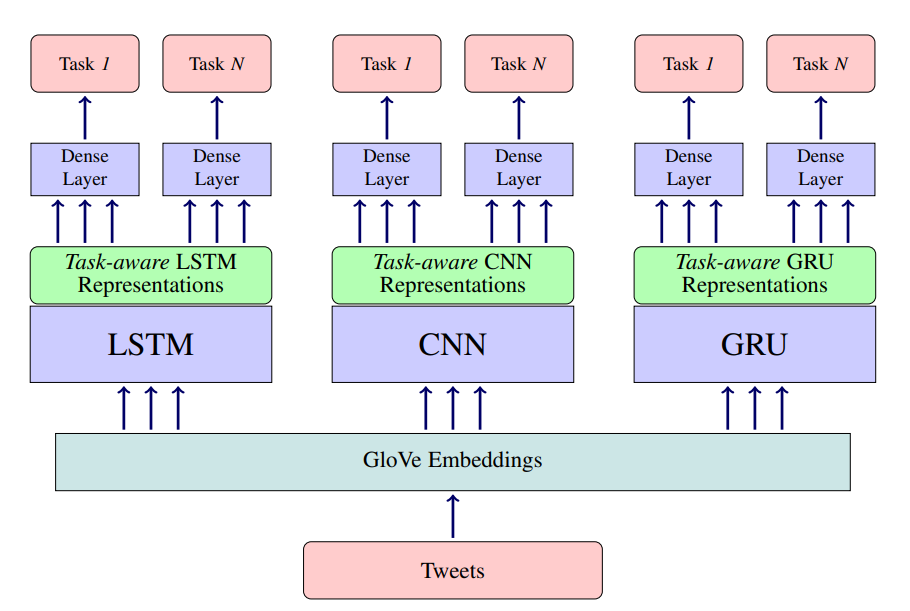

# Emotional-Analysis-Multitasking-Framework
My implementation of the research paper - [All-in-One: Emotion, Sentiment and Intensity Prediction using a Multi-task Ensemble Framework](https://www.cse.iitb.ac.in/~pb/papers/ieee-toac-sa.pdf)

## Motivation

Sentiment & Emotional Analysis have applications in a diverse set of real-world problems such as stock market predictions, disaster management systems, health management systems, feedback systems for an organization or individual user to take an informed decision. In any business, it is important to know how customers truly feel about your services and products, because that is what really makes the difference. Sales figures, surveys, social media posts, ratings may help us get a general idea about customer views but it does not provide the finer, granular insights regarding what goes unsaid. This is where emotion & sentiment analysis comes in handy.

Emotion Classification & Emotion Intensity Prediction are separate but closely related tasks. Multi-task learning framework targets to achieve generalization by leveraging the inter-relatedness of multiple problems/tasks.I worked on the framework proposed in the research paper – “All-in-One: Emotion, Sentiment and Intensity Prediction using a Multi-task Ensemble Framework”. I rebuilt the model to examine & compare performance of multi-tasking framework and single tasking framework on emotion classification & emotion intensity predictions tasks.

## Multi-Tasking Framework

Multitask Learning is an approach to inductive transfer that improves generalization by using the domain information contained in the training signals of related tasks as an inductive bias. It does this by learning tasks in parallel while using a shared representation; what is learned for each task can help other tasks be learned better. By using MTL, it might be possible to increase performance even further by forcing the model to learn a more generalized representation as it learns (updates its weights) not just for one specific task but a bunch of tasks. Biologically, humans learn in the same way. learn better if learn multiple related tasks instead of focusing on one specific task for a long time.

 
 

A multi-task framework offers three main advantages:
1. Achieves better generalization. 
2. Improves the performance of each task through shared representation; and 
3. Requires only one unified model in contrast to separate models for each task in single-task setting, resulting in complexity in terms of learnable model parameters.
